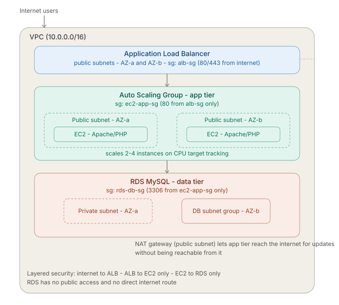

# Three-Tier Web Application on AWS

A production-style 3-tier architecture built on AWS: Application Load Balancer,
Auto Scaling EC2 instances, and a private RDS MySQL database — all inside a
custom VPC across two Availability Zones.

## Architecture

## What it does

- Load balances incoming traffic across EC2 instances in public subnets
- Auto Scaling Group maintains 2-4 instances based on CPU utilization
- App tier (Apache + PHP) connects to a MySQL RDS database
- Database sits in private subnets with zero public internet access

## Security design

- ALB security group: accepts HTTP traffic from the internet
- EC2 security group: accepts traffic only from the ALB
- RDS security group: accepts traffic only from the EC2 app tier
- The database is never directly reachable, even if someone had the EC2 instance's IP

## Tech used

AWS VPC, EC2, RDS (MySQL), Application Load Balancer, Auto Scaling Groups,
Security Groups, NAT Gateway, Route Tables, Apache, PHP

## Proof it works

**Successful connection through the load balancer:**

**RDS database available:**

**Auto Scaling Group with healthy instances:**

## What I learned

- How to design least-privilege network security using layered security groups
- The difference between public and private subnets and when to use each
- How Auto Scaling Groups integrate with Load Balancer target group health checks
- Troubleshooting real AWS networking issues (route tables, security group scoping)